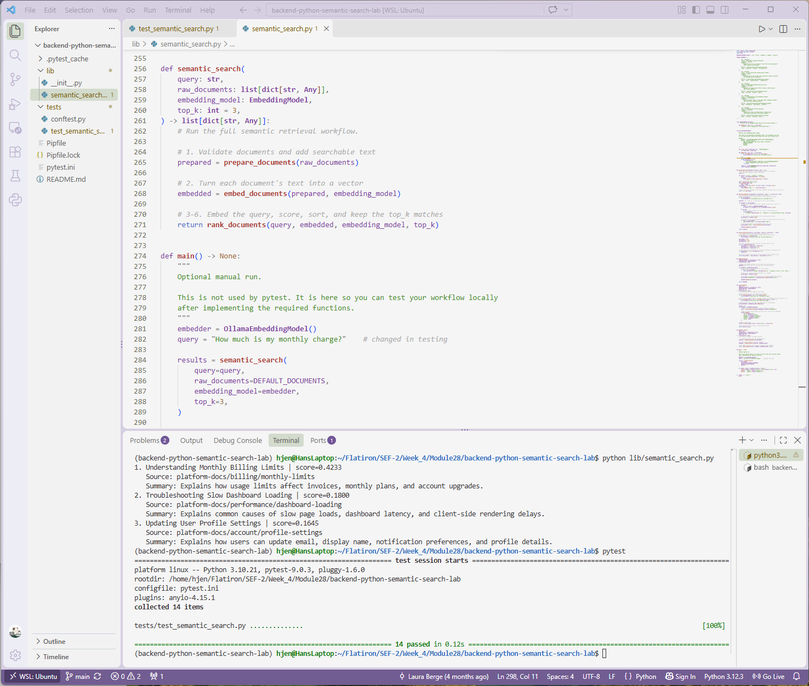

# Lab: Build a Semantic Search Workflow
**Completed Sept 28, 2026**

## Overview

A Python semantic search tool for internal developer documentation. Given a natural-language question, it embeds the query and a set of documents, compares them with cosine similarity, and returns the top-k most relevant documents with their source metadata.
 
All 14 tests in the provided pytest suite pass.
 

 
---
 
## The Problem
 
Developers search documentation in everyday language, but the docs use formal titles and summaries. A keyword search for:
 
> "The mobile client says its login key is stale."
 
might miss the most useful article, **"Fixing Invalid API Authentication Tokens,"** because the query never uses the words "API," "authentication," or "token." Semantic search compares *meaning* instead of exact words, so the right article still ranks first.
 
---
 
## How It Works
 
The workflow follows **Identify → Assemble → Execute → Verify**:
 
```
raw documents → prepare → embed documents → embed query → cosine similarity → rank → top-k results
```
 
Each stage is a small, tested function in `lib/semantic_search.py`:
 
| Function | What it does |
| --- | --- |
| `build_search_text()` | Combines a document's title, category, summary, and tags into one labeled string for the embedding model. |
| `prepare_documents()` | Rejects an empty document list, validates that required fields (`id`, `title`, `category`, `summary`, `source`) are present and not blank, and returns copied documents (with their own copy of the `tags` list) plus an added `text` field. |
| `cosine_similarity()` | Computes cosine similarity with plain Python (no NumPy). Returns `0.0` for zero vectors and raises `ValueError` on mismatched dimensions. |
| `embed_documents()` | Requires each document to have a `text` field, calls the embedding model once per document, and returns copies with an added `embedding` field. |
| `rank_documents()` | Validates the query and `top_k`, embeds the query, scores every document, sorts by score (highest first), and returns the top-k results. |
| `semantic_search()` | Orchestrates the full pipeline by calling the helpers above in order. |
 
### Result format
 
Each result includes source metadata so it can be traced back to its origin. Internal fields like `text` and `embedding` are left out.
 
```python
{
    "id": "DOC-102",
    "title": "Fixing Invalid API Authentication Tokens",
    "category": "api",
    "summary": "Explains how to resolve API calls blocked by expired, missing, or malformed bearer credentials.",
    "source": "platform-docs/api/authentication-tokens",
    "score": 0.46
}
```
 
### Design decisions
 
- **No input mutation.** Every function returns new dictionaries. The original documents, including `DEFAULT_DOCUMENTS`, are never changed.
- **Validation at the edges.** Empty document lists, missing fields, empty queries, and invalid `top_k` values all raise `ValueError` with a clear message.
- **One model for everything.** Documents and queries use the same embedding model, so their vectors can be compared.
- **Stable cosine similarity.** The denominator uses a single square root of the product of the sums of squares, which avoids floating-point drift (for example, identical vectors return exactly `1.0`).
- **No hard-coding.** The code works with any document set, any query, and any positive `top_k`. Slicing safely returns fewer results when `top_k` exceeds the number of documents.
---
 
## Project Structure
 
```
backend-python-semantic-search-lab/
├── Pipfile
├── Pipfile.lock
├── pytest.ini
├── README.md
├── semantic-search-lab.png
├── lib/
│   ├── __init__.py
│   └── semantic_search.py
└── tests/
    ├── conftest.py
    └── test_semantic_search.py
```
 
---
 
## Setup
 
Requires Python 3.10+ and `pipenv`.
 
```bash
pipenv install
pipenv shell
```
 
## Running the Tests
 
```bash
pytest -v
```
 
The test suite uses a deterministic fake embedding model, so it doesn't require internet access or Ollama.
 
---
 
## Trying It with a Real Embedding Model (Optional)
 
With [Ollama](https://ollama.com) installed and running:
 
```bash
ollama pull embeddinggemma
python lib/semantic_search.py
```
 
This runs `main()`, which searches `DEFAULT_DOCUMENTS` with the query set in the `query` line (currently *"How much is my monthly charge?"*) and prints the top 3 results.
 
Example output from an earlier run with the query *"Why does the mobile app say my token is expired?"*:
 
```
1. Fixing Invalid API Authentication Tokens | score=0.4600
   Source: platform-docs/api/authentication-tokens
2. Resetting a Forgotten Password | score=0.2823
   Source: platform-docs/account/password-reset
3. Troubleshooting Slow Dashboard Loading | score=0.2366
   Source: platform-docs/performance/dashboard-loading
```
 
The correct article ranks first even though the query and the document share few exact words. Real-model scores vary by model; the gap between results matters more than the raw numbers.
 
To try other queries, edit the `query` line in `main()`. Other queries tested or suggested:
 
- "How much is my monthly charge?" → billing limits
- "I can't remember how to get into my account" → password reset
- "Why was I charged more this month?" → billing limits
- "My reports page takes forever to show up" → dashboard loading
---
 
## Why Source Metadata Matters
 
Returning `id`, `title`, and `source` with every result makes the output traceable. A user, frontend, or future RAG system can see exactly which document a result came from, which is what later tools (a Flask API, a vector database, or a LangChain retriever) build on.
 